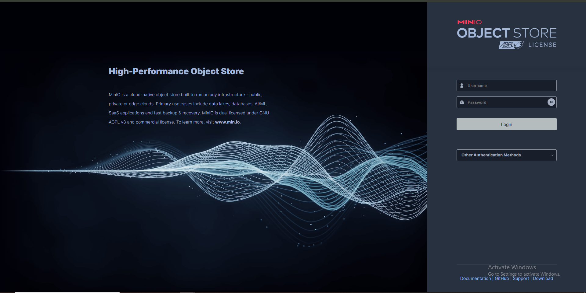
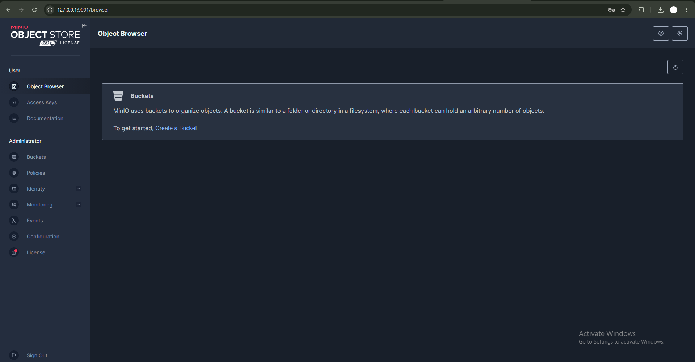
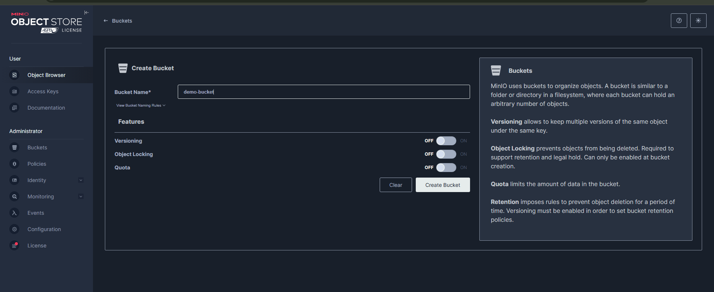
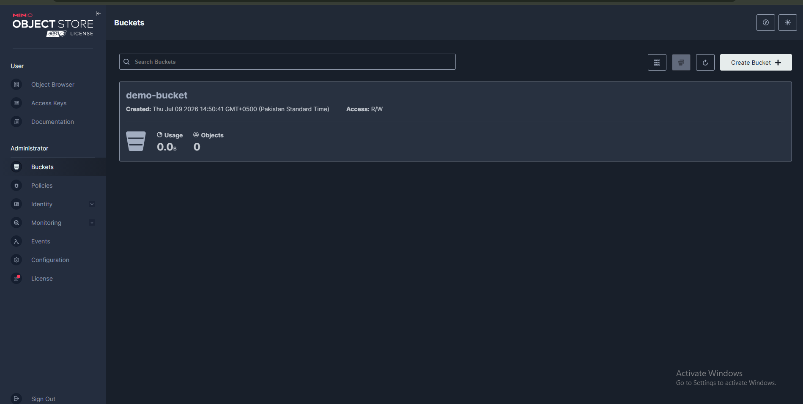
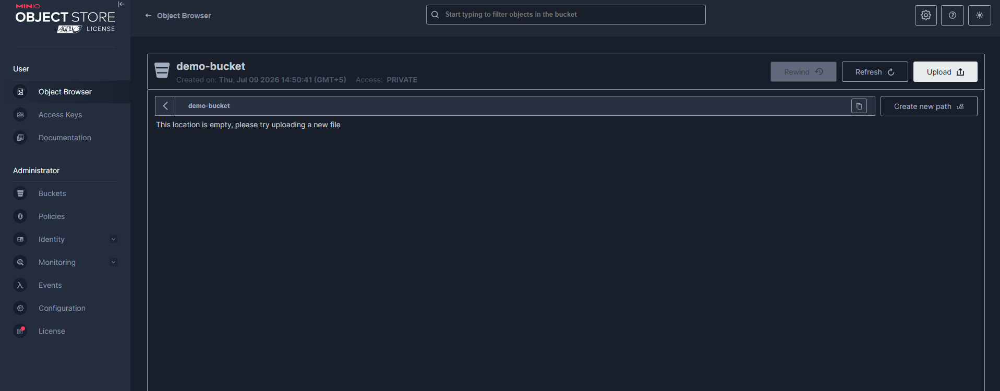
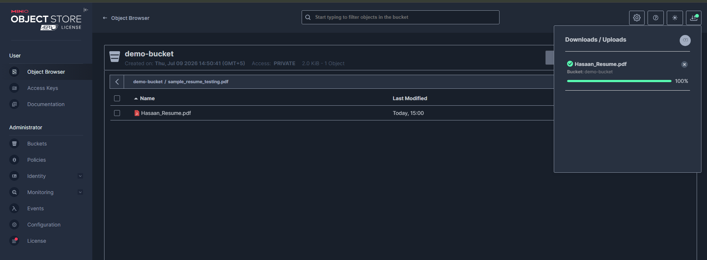
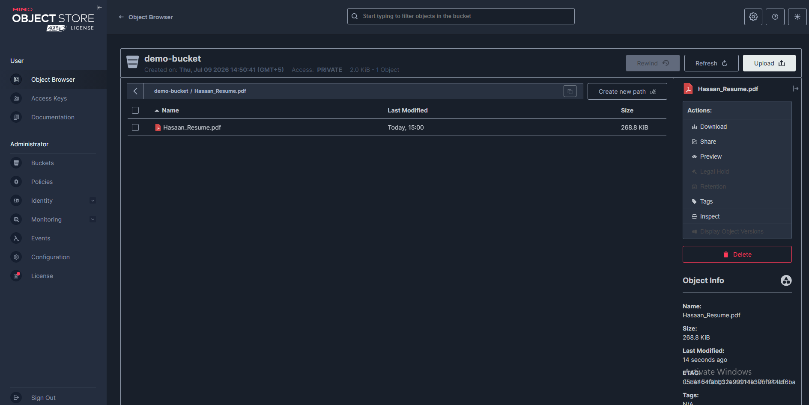
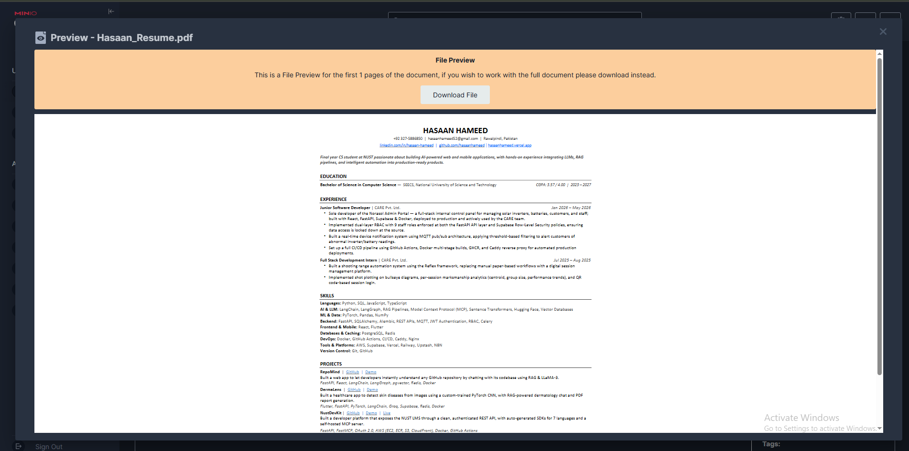

# S3-Compatible Storage Demo (MinIO)

A mini activity demonstrating how to store, access, and retrieve data using
MinIO — a self-hosted, S3-compatible object storage server — as an
open-source alternative to AWS S3.

## Why MinIO instead of AWS S3

"S3" is an API standard, not a specific product. Anything that implements the
same HTTP API (MinIO, SeaweedFS, Ceph, etc.) is a drop-in replacement — same
client code (e.g. `boto3`), just pointed at a different server. This project
proves that by running a local S3-compatible server and interacting with it
exactly like you would with real AWS S3.

## Note on MinIO's licensing

MinIO's open-source repo was archived on **Apr 25, 2026**. The last fully
open-source release (with the free web console still included) was
**`RELEASE.2025-04-22T22-12-26Z`** (Apr 23, 2025) — the version used in this
project. Later releases moved the web console and other features behind
MinIO's paid "AiStor" product.

## Setup

1. Downloaded `minio.exe` (RELEASE.2025-04-22T22-12-26Z) and placed it at `C:\minio\minio.exe`
2. Verified the install:
   ```powershell
   .\minio.exe --version
   ```
3. Started the server with both the S3 API and the web console enabled:
   ```powershell
   .\minio.exe server C:\minio\data --console-address ":9001"
   ```
   This starts:
   - **API server** (port 9000) — the actual S3-compatible endpoint
   - **Web console** (port 9001) — visual dashboard for managing buckets/objects

## Demo walkthrough (via web console)

1. Login screen
   

2. Initial console, no buckets yet
   

3. Creating a bucket (`demo-bucket`)
   

4. Bucket created
   

5. Opened the bucket via Object Browser
   

6. Uploaded a PDF file
   

7. Accessing/managing the uploaded object (download, share, preview, delete)
   

8. Previewing the file directly in the browser
   

## Demo walkthrough (via Python / boto3)

`demo.py` performs the same store → access → retrieve flow programmatically,
using `boto3` (the same SDK used for real AWS S3) pointed at the local MinIO
server:

```bash
pip install -r requirements.txt
python demo.py
```

Steps performed:
1. **Store** — creates a bucket (if it doesn't already exist) and uploads a file
2. **Access** — lists objects in the bucket
3. **Retrieve** — downloads the file back and prints its contents
