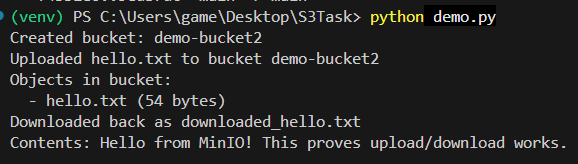
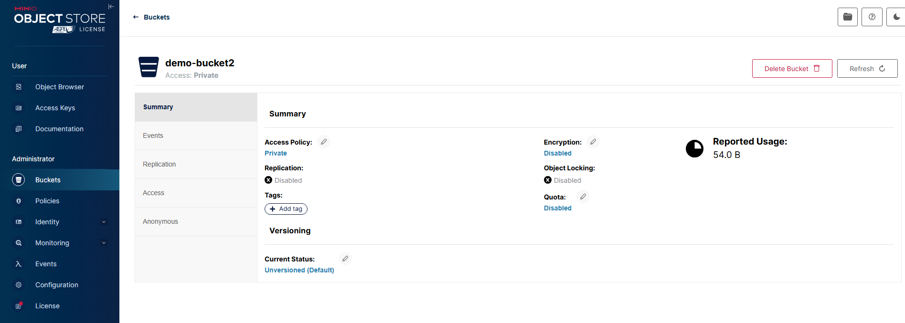
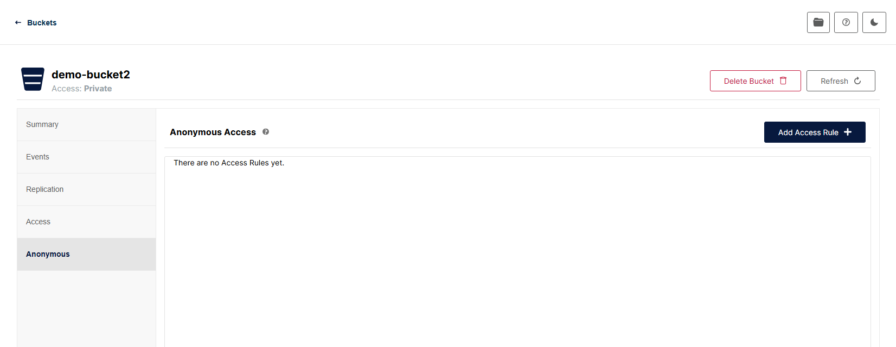
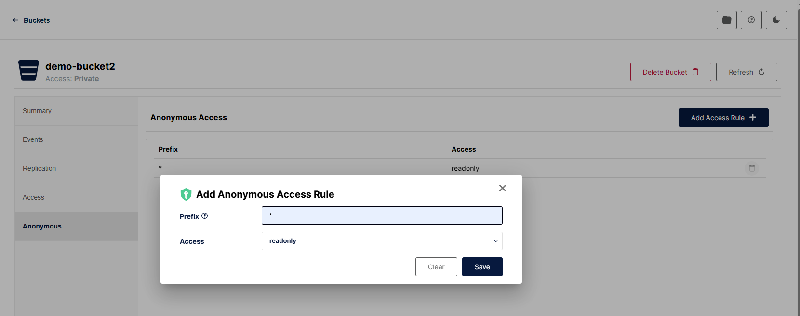
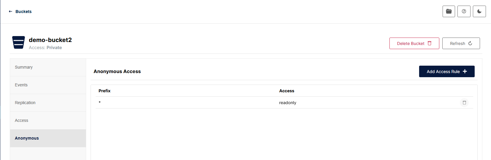
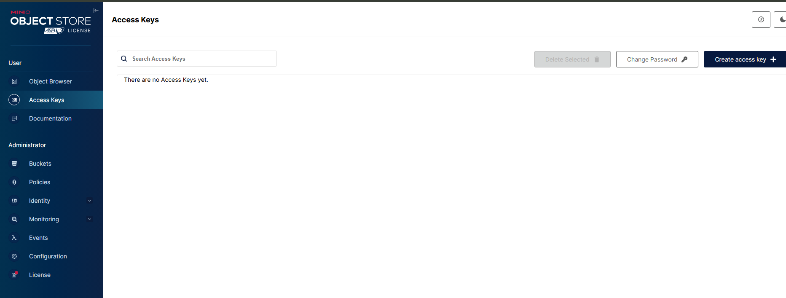
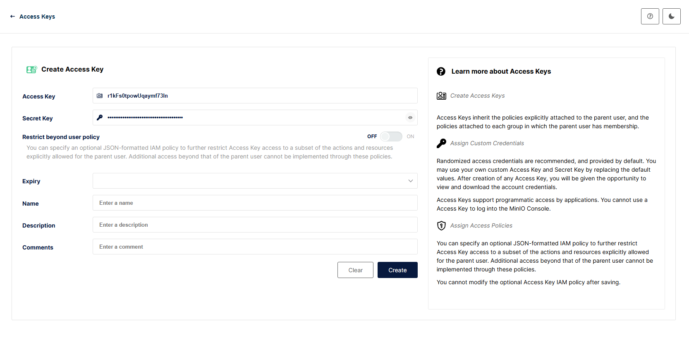
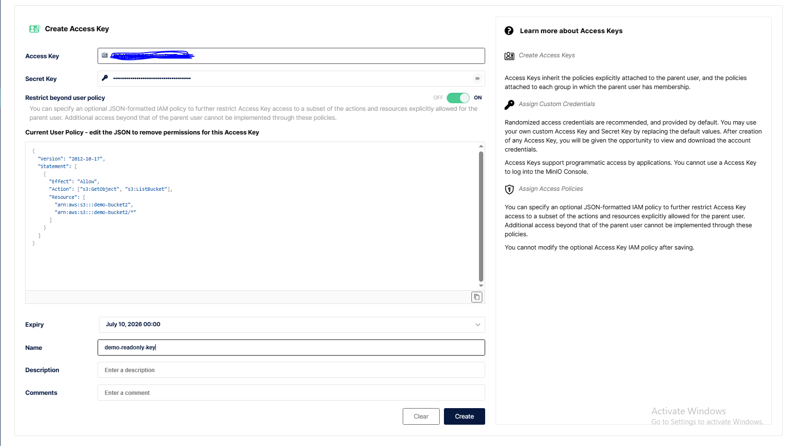
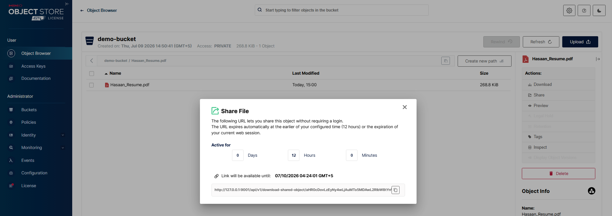

# S3-Compatible Storage Demo (MinIO)

A mini activity demonstrating how to store, access, and retrieve data using
MinIO — a self-hosted, S3-compatible object storage server — as an
open-source alternative to AWS S3.

## Why MinIO instead of AWS S3

"S3" is an API standard, not a specific product. Anything that implements the
same HTTP API (MinIO, SeaweedFS, Ceph, etc.) is a drop-in replacement — same
client code (e.g. `boto3`), just pointed at a different server. This project
proves that by running a local S3-compatible server and interacting with it
exactly like you would with real AWS S3.

## Note on MinIO's licensing

MinIO's open-source repo was archived on **Apr 25, 2026**. The last fully
open-source release (with the free web console still included) was
**`RELEASE.2025-04-22T22-12-26Z`** (Apr 23, 2025) — the version used in this
project. Later releases moved the web console and other features behind
MinIO's paid "AiStor" product.

## Setup

1. Downloaded `minio.exe` (RELEASE.2025-04-22T22-12-26Z) and placed it at `C:\minio\minio.exe`
2. Verified the install:
   ```powershell
   .\minio.exe --version
   ```
3. Started the server with both the S3 API and the web console enabled:
   ```powershell
   .\minio.exe server C:\minio\data --console-address ":9001"
   ```
   This starts:
   - **API server** (port 9000) — the actual S3-compatible endpoint
   - **Web console** (port 9001) — visual dashboard for managing buckets/objects

## Demo walkthrough (via web console)

1. Login screen
   

2. Initial console, no buckets yet
   

3. Creating a bucket (`demo-bucket`)
   

4. Bucket created
   

5. Opened the bucket via Object Browser
   

6. Uploaded a PDF file
   

7. Accessing/managing the uploaded object (download, share, preview, delete)
   

8. Previewing the file directly in the browser
   

## Demo walkthrough (via Python / boto3)

All scripts live in [`demo-codes/`](demo-codes/). `demo-codes/demo.py`
performs the same store → access → retrieve flow programmatically, using
`boto3` (the same SDK used for real AWS S3) pointed at the local MinIO
server:

```bash
pip install -r requirements.txt
python demo-codes/demo.py
```

Steps performed:

1. **Store** — creates a bucket (if it doesn't already exist) and uploads a file
2. **Access** — lists objects in the bucket
3. **Retrieve** — downloads the file back and prints its contents

Actual output from running the script:


```
Created bucket: demo-bucket2
Uploaded hello.txt to bucket demo-bucket2
Objects in bucket:
  - hello.txt (54 bytes)
Downloaded back as downloaded_hello.txt
Contents: Hello from MinIO! This proves upload/download works.
```

Each line maps directly to one of the three requirements: bucket creation +
upload (**store**), the object listing (**access**), and the download +
printed file contents (**retrieve**) — confirming the round trip is exact,
what was uploaded is exactly what came back down.

## Access control: private, public, and scoped access

By default every bucket is **private** — every request needs a valid access
key + secret key, regardless of which machine it comes from. MinIO supports
the same access-control model as AWS S3, with two independent layers:

- **Bucket policies** — rules attached to a bucket itself, e.g. "let anyone
  read this bucket without credentials." Applied per-bucket (or per-prefix,
  e.g. only a `public/` folder), separate from any specific user.
- **IAM policies** — rules attached to a specific user/access key, e.g. "this
  key can only read `demo-bucket2`, nothing else." Applied per-identity,
  independent of any single bucket's own policy.

### 1. Making a bucket publicly readable (anonymous access)

Went to Buckets → Administrator, opened `demo-bucket2` — private by default:



"Anonymous" means a request with no credentials at all — the technical term
for what's casually called "public." The **Anonymous** tab starts empty
(no rules → fully private, no one without access + secret key can reach it):



Adding a rule: `Prefix: *` (whole bucket), `Access: readonly` — this only
grants anonymous `GetObject`/list, never write or delete:



Rule saved — the bucket is now publicly readable, still not writable:



Rules can also be scoped to a specific prefix (e.g. `public/*`) instead of
the whole bucket (`*`), so only one folder is public while the rest stays
private — useful when a bucket has both public and sensitive data.

### 2. Scoped access keys (least privilege)

Instead of sharing the root credentials, MinIO lets you create additional
**access keys** restricted to a specific IAM policy — e.g. read-only access
to one bucket only. Starts with no keys created:



Creating a new key, with **"Restrict beyond user policy"** toggled on so it
doesn't inherit full root access:



Policy used (only allows `GetObject`/`ListBucket` on `demo-bucket2`):

```json
{
  "Version": "2012-10-17",
  "Statement": [
    {
      "Effect": "Allow",
      "Action": ["s3:GetObject", "s3:ListBucket"],
      "Resource": ["arn:aws:s3:::demo-bucket2", "arn:aws:s3:::demo-bucket2/*"]
    }
  ]
}
```



### 3. Testing the scoped key actually works

`demo-codes/test_access_control.py` uses the scoped key (read from
environment variables, never hardcoded) to prove the restriction is
enforced server-side, not just configured and assumed to work:

```powershell
$env:SCOPED_ACCESS_KEY = "<access key from the console>"
$env:SCOPED_SECRET_KEY = "<secret key from the console>"
python demo-codes/test_access_control.py
```

It attempts three things and confirms the expected result for each:

1. **Read `demo-bucket2`** → succeeds (policy allows it)
2. **Write to `demo-bucket2`** → denied (`PutObject` was never granted)
3. **Read `demo-bucket`** (the other bucket) → denied (key is scoped to
   `demo-bucket2` only)

Actual output:

```
Trying to READ from demo-bucket2 (should succeed)...
  OK - found: hello.txt

Trying to WRITE to demo-bucket2 (should be denied)...
  DENIED as expected: AccessDenied

Trying to access demo-bucket (should be denied, key is scoped to demo-bucket2 only)...
  DENIED as expected: AccessDenied
```

### 4. Temporary access via presigned URLs

For one-off, time-limited access to a single object without creating a
whole new key, S3/MinIO supports **presigned URLs** — a signed link that
expires after a set time, generated without exposing any access/secret
keys to whoever receives the link.

**Via code** — `demo-codes/presigned_url_demo.py` generates a link (valid
60 seconds) to `data.txt` in the still-private `demo-bucket`:

```python
url = s3.generate_presigned_url(
    "get_object",
    Params={"Bucket": BUCKET, "Key": FILE_NAME},
    ExpiresIn=60,  # seconds
)
```

```bash
python demo-codes/presigned_url_demo.py
```

Opening the printed URL works immediately (no login needed); reloading it
after 60 seconds fails, since the signature has expired.

**Via console** — the same feature is available as **Share** on any
object's Actions panel, with a configurable expiry:



Unlike a public bucket policy (permanent, applies to everyone), a presigned
URL is scoped to **one object** and **expires** — a much smaller blast
radius if the link ever leaks.
