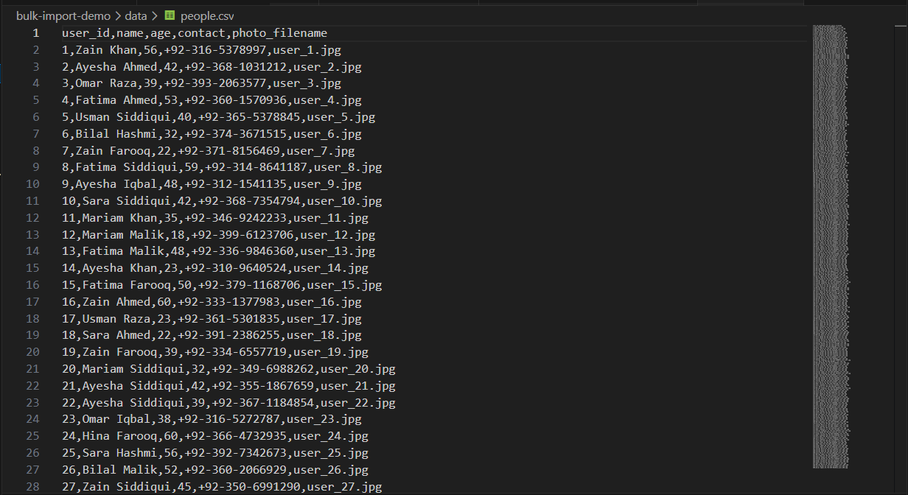
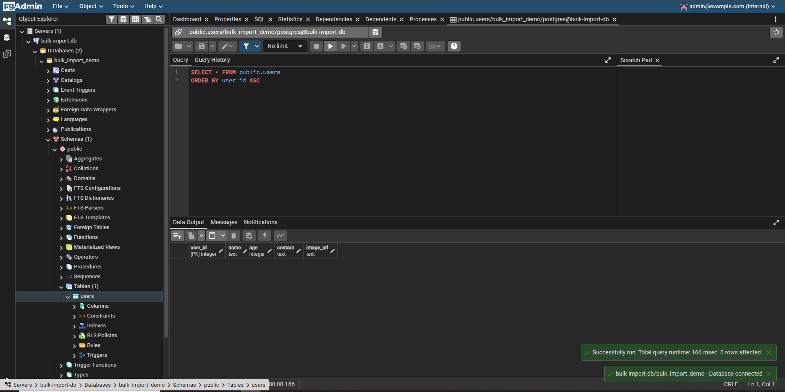
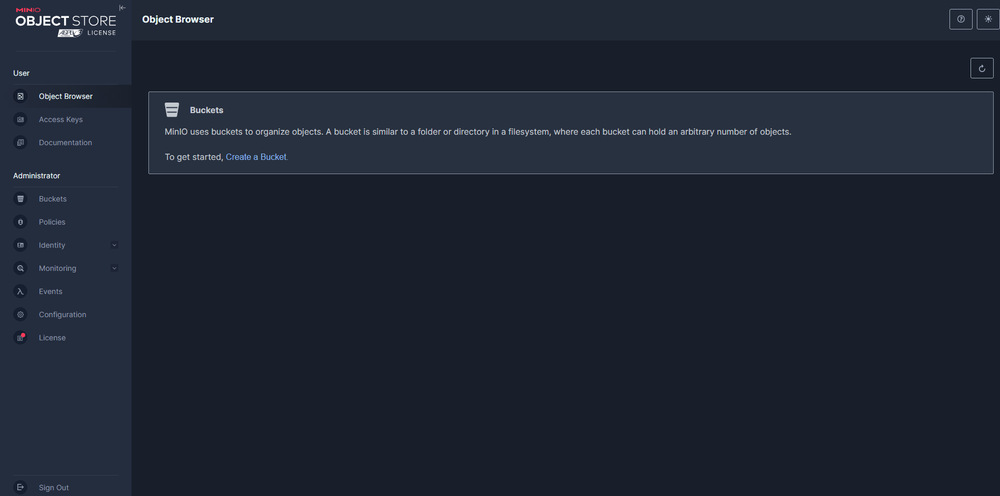
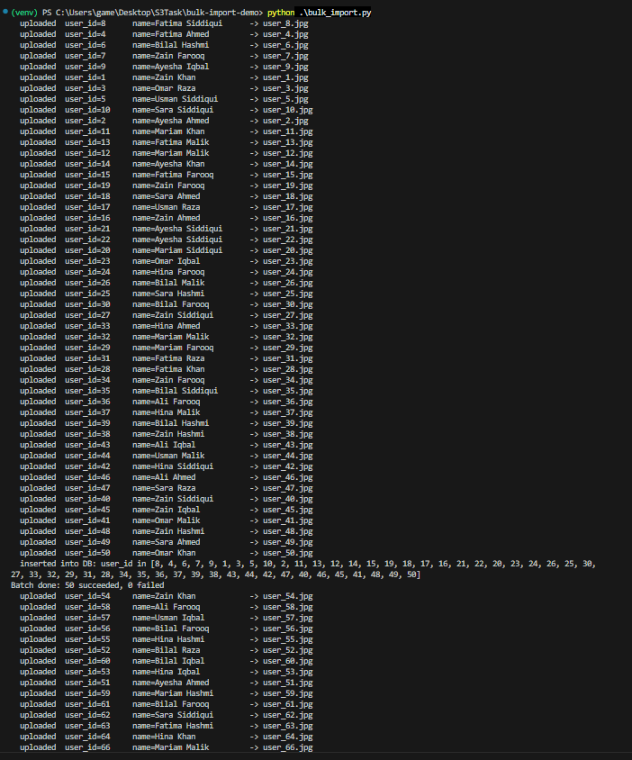
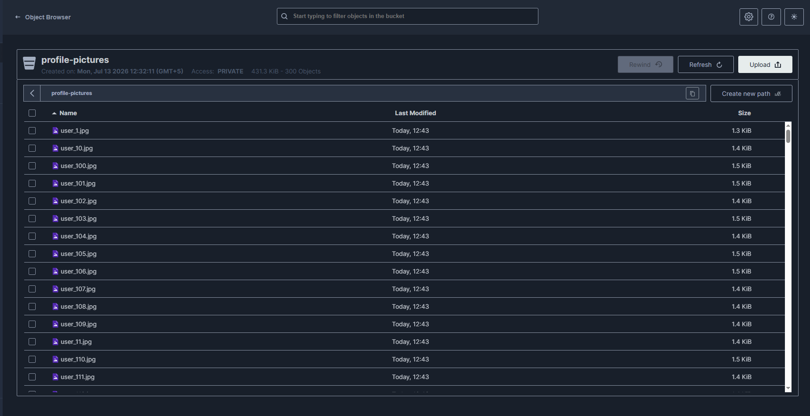
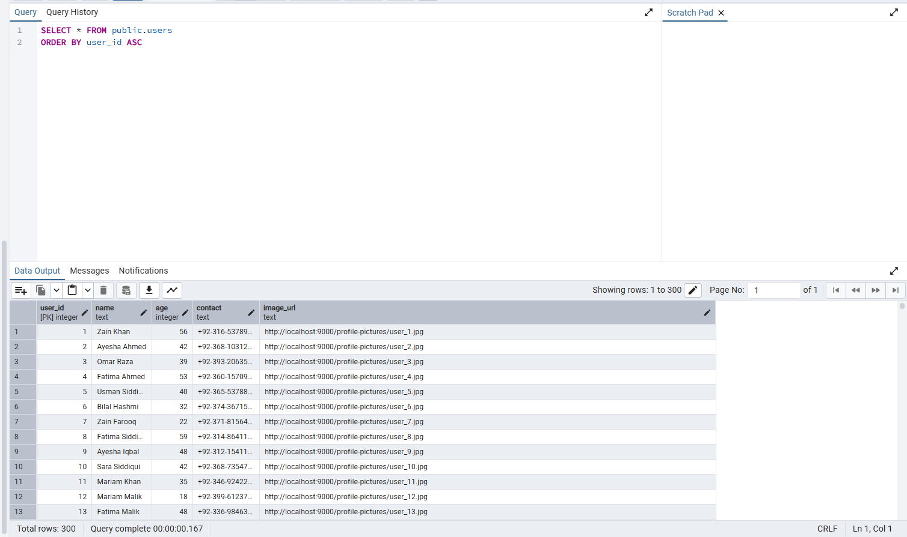

# Bulk Import Demo (Approach 1: Upload-First, Deterministic Naming)

Demonstrates one of the approaches discussed for reliably bulk-importing
large volumes of user data into a system where structured metadata lives in
a relational database, and each user's profile picture lives in an
S3-compatible bucket (MinIO), linked via a URL stored in the database.

## Problem

We need to bulk-import a large number of user records (potentially hundreds
of thousands). Each record has structured metadata (name, age, contact)
that belongs in a relational database, plus a profile picture that belongs
in an S3-compatible bucket — with the database storing a URL pointing to
that image.

Processing this manually, one record at a time, isn't practical at scale.
The core challenge: the database write and the S3 upload are two separate
operations, not one transaction. If one succeeds and the other fails, the
two systems can fall out of sync.

## Approach implemented here: upload-first, deterministic naming

For each record:

1. Upload the profile picture to MinIO first, named predictably (e.g.
   `user_12345.jpg`) so retries are safe (they simply overwrite, no
   duplicates or orphaned files from retries).
2. Only after the upload succeeds, insert the record into Postgres with
   the resulting image URL — this guarantees no database row ever points
   to a missing image.

Records are processed in parallel batches (not one at a time) to avoid an
impractically slow sequential run, and any row that fails is logged
separately instead of stopping the whole import, so it can be retried later
without re-running everything.

## Components

- `generate_sample_data.py` — one-time script that creates fake demo data:
  a CSV of people (`data/people.csv`) and a matching placeholder image per
  person (`sample_images/`). Uses Pillow; not part of the actual import
  logic.
- `db/docker-compose.yml` + `db/schema.sql` — spins up Postgres (with the
  `users` table auto-created on first start) and pgAdmin for visualizing
  the data.
- `bulk_import.py` — the actual Approach 1 implementation: reads the CSV in
  batches, uploads images to MinIO in parallel, and bulk-inserts successful
  rows into Postgres, logging failures separately.

## Setup

1. Start MinIO (same server as the main repo's demo):

   ```powershell
   cd C:\minio
   .\minio.exe server C:\minio\data --console-address ":9001"
   ```

2. Start Postgres + pgAdmin:

   ```bash
   cd bulk-import-demo/db
   docker compose up -d
   ```

   This automatically creates the `users` table from `schema.sql` on first
   run — no manual step needed.

3. Generate the fake dataset:

   ```bash
   python bulk-import-demo/generate_sample_data.py
   ```

   Produces 300 fake records:
   

4. Confirm the database is reachable and the table exists. Two ways to
   view it:
   - **pgAdmin web** (bundled in the compose stack): `http://localhost:5050`,
     login `admin@example.com` / `demopassword`, register a server with
     host `postgres`, port `5432` (internal Docker network port).
   - **pgAdmin Desktop** (or any external client): host `localhost`, port
     `5434` (the host-mapped port from `docker-compose.yml`), db
     `bulk_import_demo`, user `postgres`, password `demopassword`.

   Either way, at this point the `users` table exists but is empty:
   

   The MinIO bucket doesn't exist yet either - it gets created
   automatically by `bulk_import.py` on first run:
   

## Running the import

```bash
python bulk-import-demo/bulk_import.py
```

The script logs each upload and each batch's DB insert as it happens:


## Result

All 300 profile pictures land in the `profile-pictures` bucket:


And all 300 records are in Postgres, each with an `image_url` pointing at
its corresponding MinIO object:


If any row's upload fails, it's written to `failed_rows.csv` instead of
stopping the run, and can be retried later by re-running the import against
just that file. Re-running against already-imported rows is also safe -
the `INSERT ... ON CONFLICT DO UPDATE` in `bulk_import.py` means reruns
update existing rows instead of creating duplicates.
